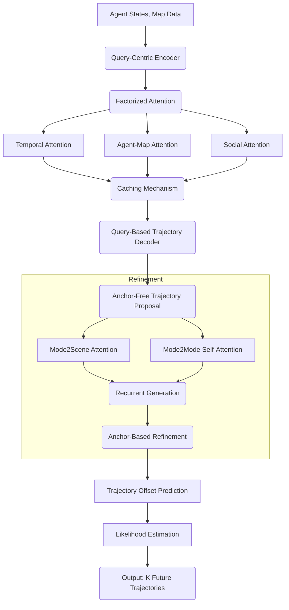
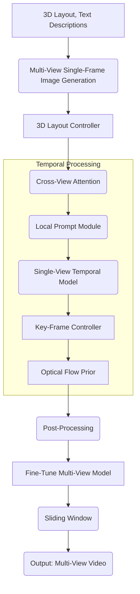
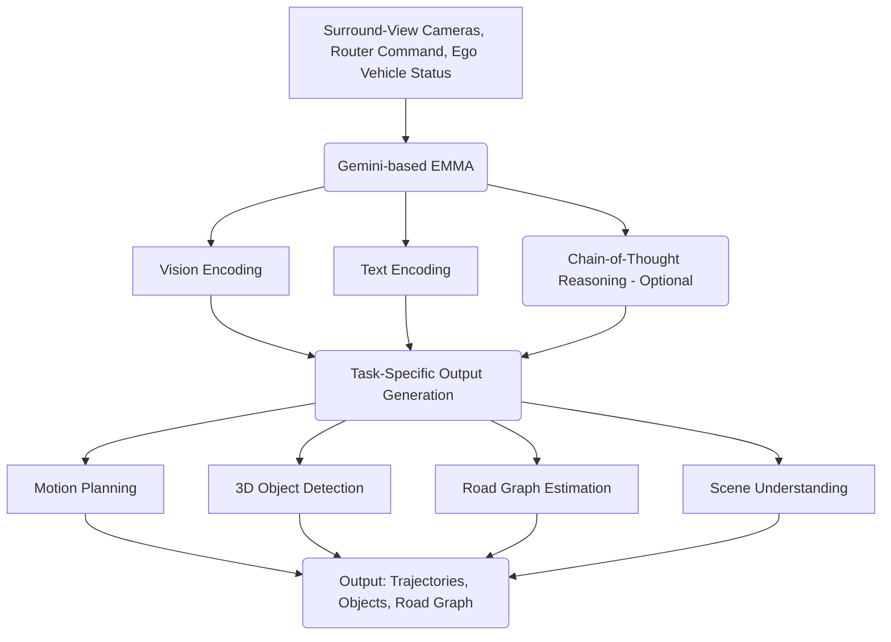

# System Architecture Diagrams for Autonomous Driving Models

This document presents system architecture diagrams for three autonomous driving models: **QCNet, DrivingDiffusion, and EMMA**. The diagrams are created using **Mermaid** syntax.

## 1. QCNet: Query-Centric Trajectory Prediction

## 2. DrivingDiffusion: Multi-View Video Generation

## 3. EMMA: End-to-End Multimodal Model for Autonomous Driving

